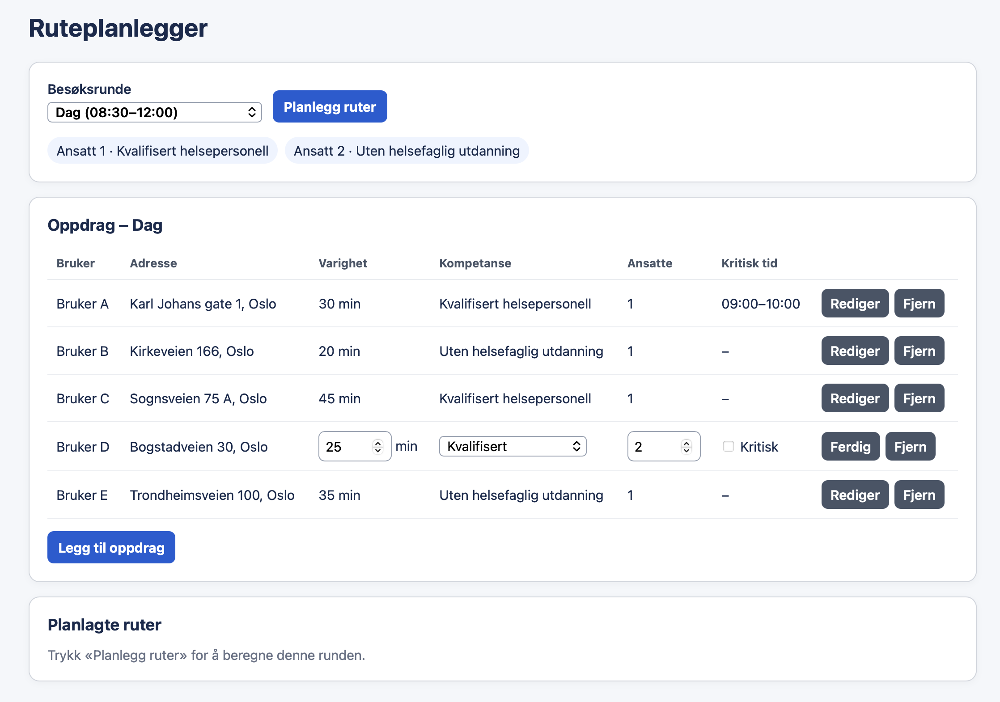
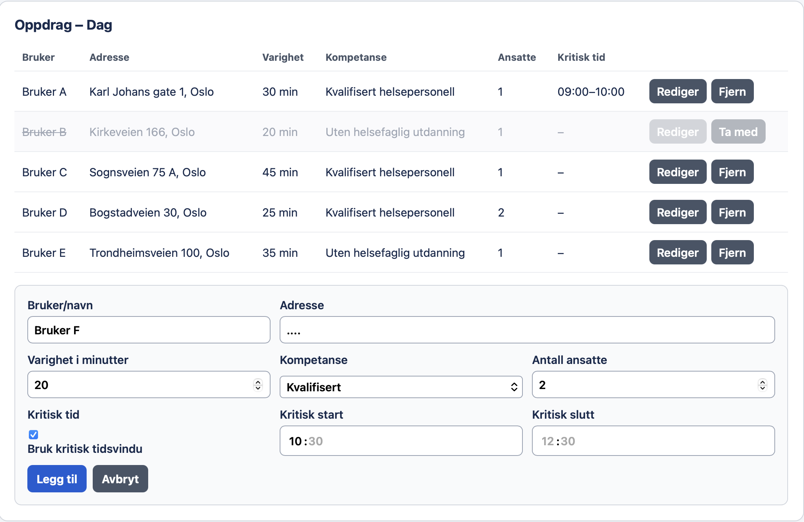
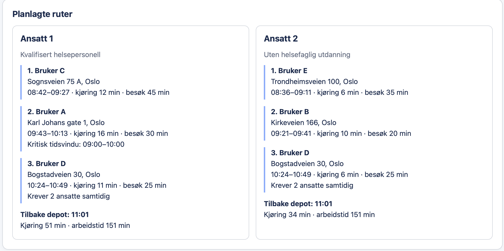

# Home Healthcare Route Planner

A Python prototype for assigning and optimizing home healthcare visits among
available staff members.

The application uses real driving times from OpenRouteService and Google
OR-Tools to create routes while considering staff qualifications, visit time
requirements, workload balance, and visits requiring multiple employees.

> **Important:** This is a learning and portfolio project. All included users, employees, and schedules are fictional. Public real-world addresses are used solely to demonstrate route calculations and are not associated with real patients.

## Features

- Optimizes routes for multiple employees with Google OR-Tools.
- Retrieves real-world driving times from OpenRouteService.
- Converts newly entered addresses into coordinates automatically.
- Supports four separate visit rounds:
  - Day: 08:30–12:00
  - Lunch: 13:00–14:00
  - Dinner: 15:00–18:00
  - Evening: 19:00–22:00
- Plans one selected visit round at a time.
- Includes only employees who are active during the selected round.
- Supports two qualification levels:
  - Qualified healthcare personnel
  - Employees without formal healthcare qualifications
- Restricts qualification-dependent visits to eligible employees.
- Supports visits requiring two employees at the same time.
- Supports strict individual time windows for critical visits.
- Allows non-critical visits to start after the preferred end of a round and
  marks them as delayed.
- Balances employee workloads while minimizing total driving time.
- Provides a local browser-based interface for viewing and editing visits.
- Allows visits to be temporarily added, edited, or excluded before planning.

## Technologies

- Python 3
- Google OR-Tools
- OpenRouteService API
- HTML, CSS, and JavaScript
- Python standard-library HTTP server

No database or web framework is used in the current prototype.

## Screenshots

### Managing visits



The selected visit round shows active employees and all visits. Individual
visits can be edited or temporarily excluded before route planning.

### Adding a visit



New visits can be added with an address, duration, qualification requirement,
staffing requirement, and an optional critical time window.

### Optimized routes



The result displays each employee's assigned visits, arrival times, driving
times, qualification level, and return time to the depot.

Screenshots must only contain fictional demonstration data. Do not include API
keys, real patient information, real employee schedules, or other sensitive
information. Public addresses may be used for route demonstrations, but they
must not be presented as belonging to real home healthcare patients.

## Installation

### 1. Clone the repository

```bash
git clone https://github.com/kristinelunde/home-healthcare-route-planner.git
cd home-healthcare-route-planner
```

### 2. Create and activate a virtual environment

On macOS or Linux:

```bash
python3 -m venv .venv
source .venv/bin/activate
```

On Windows PowerShell:

```powershell
python -m venv .venv
.venv\Scripts\Activate.ps1
```

### 3. Install the dependencies

```bash
python -m pip install -r requirements.txt
```

### 4. Create an OpenRouteService API key

Create an API key through the OpenRouteService website. Do not store the real
key in the source code or commit it to Git.

On macOS or Linux, set the key for the current terminal session:

```bash
export ORS_API_KEY="your-api-key"
```

On Windows PowerShell:

```powershell
$env:ORS_API_KEY="your-api-key"
```

## Running the application

Start the graphical interface with:

```bash
python gui.py
```

The application should open automatically in the default browser. If it does
not, open the local address shown in the terminal, normally:

```text
http://127.0.0.1:8000
```

The program tries ports 8000–8009 and uses the first available port.

The terminal-based prototype can alternatively be started with:

```bash
python main.py
```

## Running the tests

The test suite uses Python's built-in `unittest` module. API responses and
driving times are simulated, so the tests do not require an API key, internet
access, or OpenRouteService quota.

Run all tests from the project root:

```bash
python -m unittest discover -s tests -v
```

## How it works

1. The user selects one visit round.
2. Only visits and active employees belonging to that round are included.
3. New addresses are geocoded through OpenRouteService.
4. OpenRouteService calculates driving times between the depot and visits.
5. OR-Tools assigns visits and determines the order of each employee's route.
6. Every employee starts and finishes at the same depot.
7. The resulting routes are displayed with arrival times, visit durations,
   driving times, delays, and total working time.

The optimization primarily minimizes driving time while also penalizing a large
difference between the longest and shortest employee route.

## Project structure

```text
.
├── ansatt.py              # Employee and route result models
├── besoksrunde.py         # Visit-round definitions and times
├── gui.html               # Browser-based user interface
├── gui.py                 # Local server and GUI integration
├── kvalifikasjon.py       # Qualification levels
├── main.py                # Example data and terminal interface
├── openrouteservice.py    # Geocoding and driving-time integration
├── oppdrag.py             # Visit model
├── requirements.txt       # Python dependency versions
└── ruteplanlegger.py      # OR-Tools optimization model
```

The optimization, API integration, data models, and user interface are kept in
separate modules so that each part can be changed independently.

## Current limitations

- The application uses fictional example data stored in the source code.
- Changes made through the interface are temporary and reset when the page is
  refreshed.
- There is no database, authentication, authorization, or audit logging.
- The application has not been designed or tested for real patient data.
- The OpenRouteService API is subject to usage limits and availability.
- Geocoding uses the first Norwegian address result and does not currently ask
  the user to confirm the location.
- The optimizer returns a good solution within a short search time, but it does
  not guarantee a mathematically optimal route for every problem size.
- The prototype does not currently model breaks, traffic changes during the
  day, preferred employee–patient relationships, or continuity of care.

## Privacy and security

Do not enter or publish real patient names, addresses, health information, or
staff schedules in this prototype.

Before using a similar system with real healthcare data, it would require a
proper security and privacy assessment, access control, secure storage, audit
logging, data-processing agreements, and compliance with applicable healthcare
and privacy regulations.

## Possible future improvements

- Read employees, shifts, and visits from persistent storage.
- Add authentication and role-based access control.
- Add automated tests and continuous integration.
- Cache geocoding and driving-time results.
- Allow users to confirm geocoded locations.
- Export completed route plans to a file or printable report.

## Project status

This project is under active development as a learning and portfolio project.
